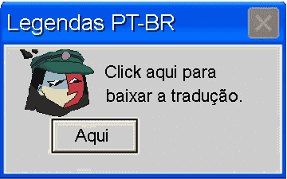
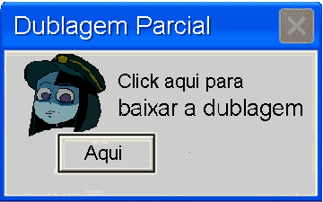
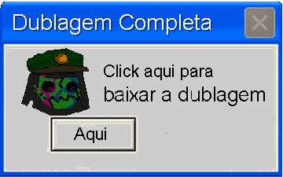

  <h1>Nós somos a equipe Nonkey Jong Team</h1>
  
🇧🇷 Fã tradução do jogo: ENA: Dream BBQ 🎭 

  ---
  
###  LEGENDA:

  A legenda inclui a tradução de todos os diálogos, textos, texturas e cutscenes do jogo, sendo focada apenas na tradução dos textos.

  

 ---

###  DUBLAGEM:
🔹 <b>Dublagem Parcial</b> — mantém a diversidade de idiomas, dublando apenas os personagens originalmente em inglês para o português.  
<small>(Recomendado caso seja sua primeira experiência)</small>

 

&nbsp;&nbsp;&nbsp;&nbsp;&nbsp;&nbsp;&nbsp;&nbsp;&nbsp;&nbsp;&nbsp;&nbsp;&nbsp;&nbsp;&nbsp;&nbsp;&nbsp;&nbsp;&nbsp;&nbsp;&nbsp;&nbsp;&nbsp;&nbsp;&nbsp;&nbsp;&nbsp;&nbsp;&nbsp;&nbsp;&nbsp;&nbsp;&nbsp;&nbsp;&nbsp;&nbsp;&nbsp;&nbsp;&nbsp;&nbsp;&nbsp;&nbsp;&nbsp;&nbsp;&nbsp;&nbsp;&nbsp;&nbsp;&nbsp;&nbsp;&nbsp;
  
 &nbsp;&nbsp;&nbsp;&nbsp;&nbsp;&nbsp;&nbsp;&nbsp;&nbsp;&nbsp;&nbsp;&nbsp;&nbsp;&nbsp;&nbsp;&nbsp;&nbsp;&nbsp;&nbsp;&nbsp;&nbsp;&nbsp;
  

🔸 <b>Dublagem Completa</b> — todos os personagens, independentemente do idioma, estarão dublados.  
<small>(Para você que já jogou e quer uma nova experiência com Ena)</small>

---

### Créditos Capítulo 1: Porta Solitária

<b>Demetrius</b> ▸ Tradução 〢 Programação 〢 Revisão 
<b>Zoti</b> ▸ Tradução 〢 Programação 〢 Vídeos e Imagens 
<b>Iggy</b> ▸ Tradução 〢 Vídeos e Imagens 
<b>Pasokad</b> ▸ Tradução 〢 Vídeos e Imagens 
<b>Sam</b> ▸ Tradução 
<b>Solurio</b> ▸ Programação 
<b>Apolo</b> ▸ Revisão  
<b>Abigail_8bits</b> ▸ Ajuda em 3D 
<b>Bixin</b> ▸ Ajuda em 3D
 

 
 

---

### ⚠️ Aviso importante:

 
 Este é um projeto de fã para fã, não é oficial e não temos qualquer relação com o Joel G e sua equipe. 
Esse trabalho não seria possivel sem a contribuição desse pessoal.
  

? Dúvidas ou problemas?
Entre em contato com a gente pelo nosso servidor do Discord: 
⫘ https://discord.gg/Jnm23pZkuC 
 𝕏 https://x.com/nonkeyjongtrans

Temos notado que a tradução está circulando por meio de uploads não oficiais.
Pedimos que não façam isso, pois é fácil uma versão antiga se espalhar enquanto uma nova já está disponível. É por isso que privamos versões antigas.
Se for postar em fóruns, grupos ou servidores, recomendamos que use o link oficial do nosso Github e/ou do nosso servidor no Discord.
Não nos responsabilizamos por quaisquer danos à sua segurança, vindo de outras versões.

---

### ✅ Dito isso, aproveitem a versão [3.0] da tradução!
### — Equipe Nonkey Jong 
